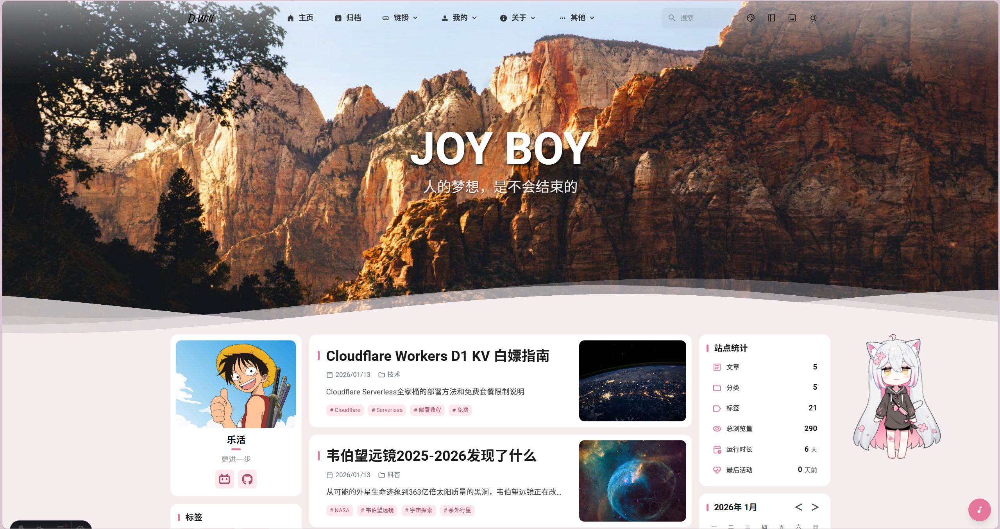
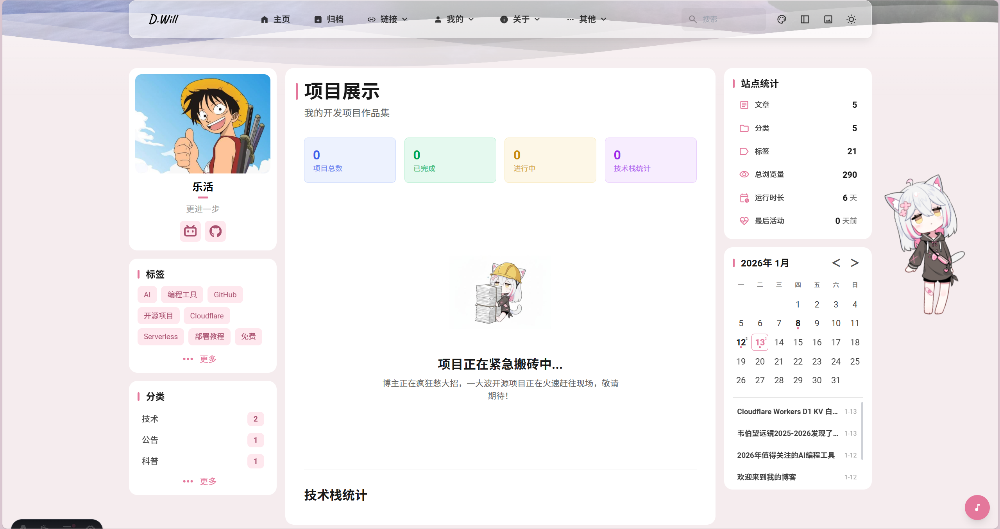
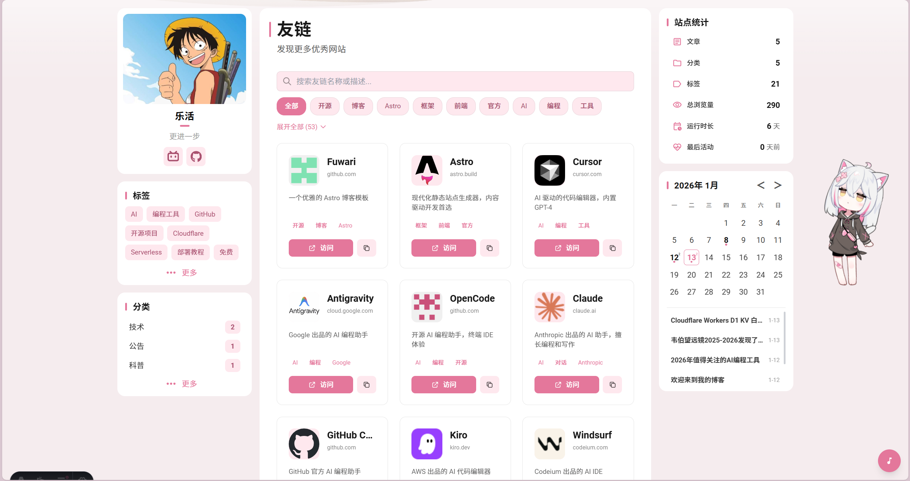
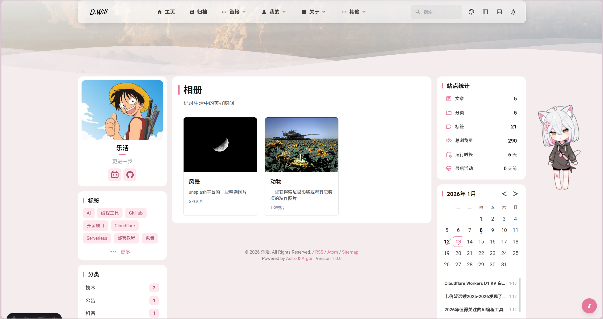
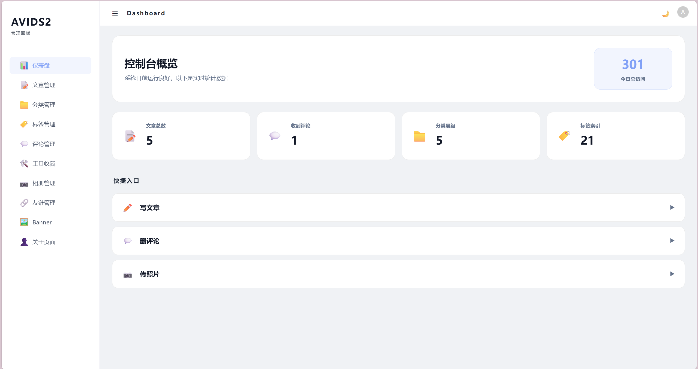
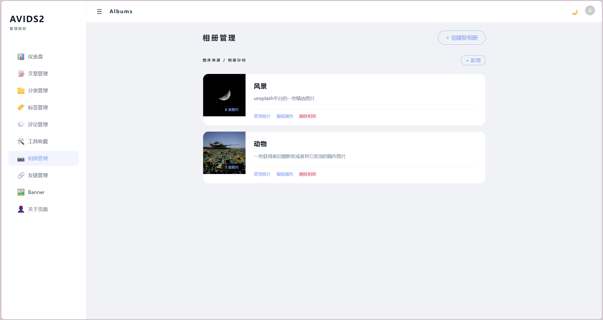
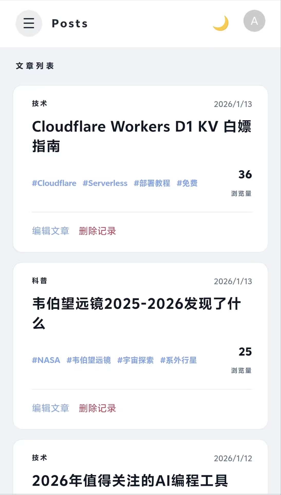

<div align="center">
  

  <h1>🌸 D.Will Blog</h1>

  <p><b>一个真正的三端全栈博客系统</b><br/>
  集成 <b>极致体验的博客端</b> + <b>移动优先的管理端</b> + <b>高性能后端 API</b></p>
  
  <p>不同于传统的静态博客，本项目提供完整的动态管理方案，且实现了<b>前台与后台的双重移动端适配</b>。</p>

  <p>
    
    
    
    
    
    
  </p>

  <p>
    <a href="https://dwill.top/"><b>🖥️ 演示站点</b></a> •
    <a href="./DEPLOY.md"><b>📖 部署文档</b></a>
  </p>
</div>

---

## 📸 预览 (Preview)

### 🖥️ 博客前台 (User Side)
<table>
  <tr>
    <td></td>
    <td></td>
  </tr>
  <tr>
    <td></td>
    <td></td>
  </tr>
</table>

### ⚙️ 管理后台 & 移动端 (Admin & Mobile)
<table>
  <tr>
    <td></td>
    <td></td>
    <td></td>
  </tr>
</table>

---

## 💎 项目核心优势

### 🛡️ 三端全栈架构 (3-Part Architecture)
本项目由三个独立的模块组成，实现了完美的动静分离与逻辑解耦：
1. **博客前端 (Astro 5)**：极致的性能与 SEO，带来如丝般顺滑的阅读感。
2. **管理后台 (Vue 3)**：基于 Naive UI 开发的现代化内容管理控制中心。
3. **后端 API (FastAPI)**：异步高性能后端，支持 RESTful API。

### 📱 真正的双重移动端适配 (Dual Mobile Mastery)
大多数开源项目只做前台适配，我们走得更远：
- **前台适配**：流式布局与侧边栏折叠，提供完美的沉浸式阅读。
- **后台适配**：管理端采用卡片式重构与手势优化，让你在**手机浏览器上也能轻松写博、管理友链、监控动态**。

### ⚙️ 动态内容引擎
- **实时管理**：无需重新构建或推送 Git，修改后台数据，前台瞬间同步更新。
- **友链/资源动态分发**：集成的资源管理中心，支持实时分类搜索与折叠展示。

---

## ✨ 特性亮点

### 🎨 极致设计
- **现代美学**：采用玻璃拟态 (Glassmorphism) 风格，极致的视觉舒适度。
- **深色模式**：支持全站深色/浅色模式无缝切换。

### 🎭 趣味交互
- **Live2D 看板娘**：支持多种动作交互，让博客更有灵气。
- **内置音乐播放器**：可在阅读时享受动听旋律。
- **视觉特效**：樱花飘落、全屏壁纸组件、Swup 页面过渡。

### 🚀 极致性能
- **自动化图片/字体压缩**：节省 90% 以上的资源体积，秒开体验。
- **本地搜索**：集成 Pagefind，在毫秒级内完成全站搜索。

---

## 🛠️ 技术栈

| 领域 | 技术方案 |
| :--- | :--- |
| **前端框架** | [Astro](https://astro.build/) + [Svelte](https://svelte.dev/) |
| **管理后台** | [Vue 3](https://vuejs.org/) + [Naive UI](https://www.naiveui.com/) |
| **后端 API** | [FastAPI](https://fastapi.tiangolo.com/) + [SQLAlchemy](https://www.sqlalchemy.org/) |
| **样式处理** | [TailwindCSS](https://tailwindcss.com/) |
| **数据库** | [SQLite](https://www.sqlite.org/) |
| **动画效果** | [Swup](https://swup.js.org/) + [PixiJS](https://pixijs.com/) |

---

## 🚀 快速开始

### 开发环境配置

如果你想在本地进行二次开发或调试：

#### 1. 克隆项目
```bash
git clone https://github.com/AVIDS2/my_blog.git
cd my_blog
```

#### 2. 后端服务 (FastAPI)
```bash
cd server
# 建议创建虚拟环境
python -m venv venv
source venv/bin/activate  # Windows: venv\Scripts\activate
pip install -r requirements.txt
# 启动
python main.py
```

#### 3. 博客前端 (Astro)
```bash
cd client
pnpm install
pnpm dev
```

#### 4. 管理后台 (Vue)
```bash
cd server/admin
npm install
npm run dev
```

---

## 📦 生产部署

推荐使用 **Docker Compose** 进行一键部署，只需运行：

```bash
# 1. 复制配置环境
cp .env.example .env

# 2. 编辑 .env 文件
# 设置你的 SECRET_KEY 和 ADMIN_PASSWORD

# 3. 启动
docker-compose up -d --build
```

详细的手动部署步骤与网络配置，请参阅 [**DEPLOY.md**](./DEPLOY.md)。

---

## 📁 目录结构

```text
.
├── client/              # 博客前端 (Astro项目)
├── server/
│   ├── app/             # 后端 API (FastAPI)
│   ├── admin/           # 管理后台 (Vue 3项目)
│   └── scripts/         # 数据管理与修复脚本
├── data/                # [持久化] 数据库文件
├── uploads/             # [持久化] 用户上传的图片
├── Dockerfile           # 多阶段构建文件
└── docker-compose.yml   # 容器编排配置
```

---

## 📝 许可证

本项目基于 **MIT License** 开源。你可以自由地使用、修改和分发。

---

<div align="center">
  <p>如果你喜欢这个项目，欢迎点一个 <b>Star</b> ⭐，这将是对我最大的支持！</p>
  <p>© 2026 Developed by <a href="https://github.com/AVIDS2">AVIDS2</a> / Design inspired by <a href="https://github.com/saicaca/fuwari">Fuwari</a> & <a href="https://github.com/matsuzaka-yuki/Mizuki">Mizuki</a></p>
</div>
